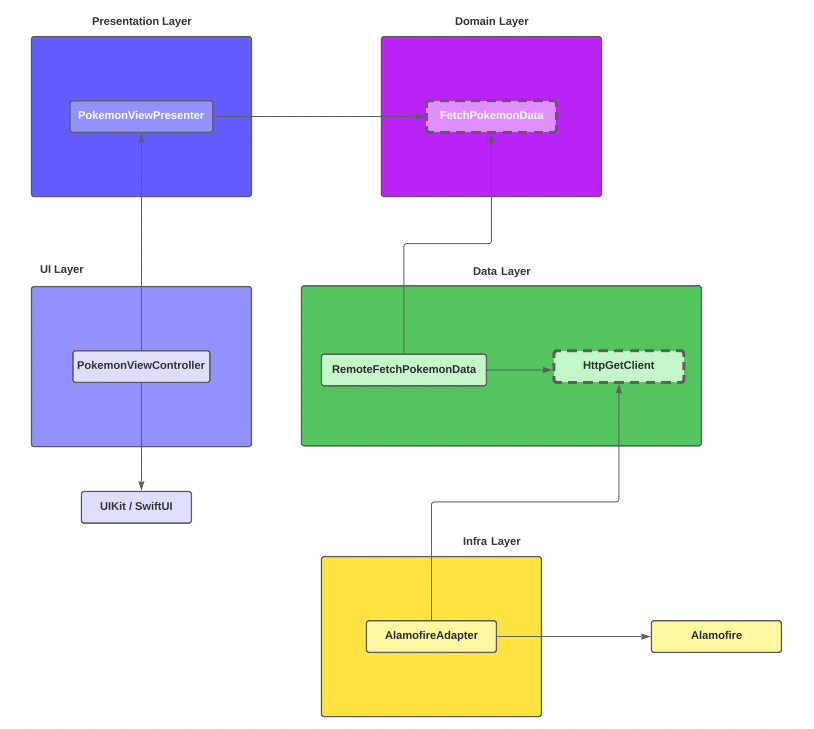

# Pokemon App

Pokemon App is actualy a Pokedex made with Swift 5 for iOS, following good development practices.

## Inside this project

* HTTP requests using Alamofire
* High unit test coverage
* Integration tests
* Clean Architecture principles
* Highly decoupled code
* Interface made with View Code

## App Architecture

## Observations

This project data is fetched from the [PokeApi](https://pokeapi.co/)

